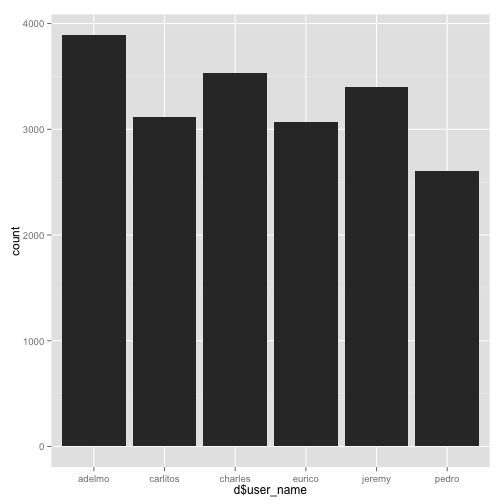
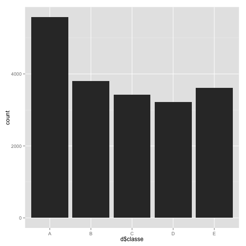

Predicting physical workout correctness
=======================================

First of all let's load the dataset.


```r
library(ggplot2)
d <- read.csv('pml-training.csv')
```


```r
qplot(d$user_name)
```

 

```r
summary(d$user_name)
```

```
##   adelmo carlitos  charles   eurico   jeremy    pedro 
##     3892     3112     3536     3070     3402     2610
```

```r
mean(table(d$user_name))
```

```
## [1] 3270.333
```

The dataset has an average 3270 data points per user, for a total 19622 observations.

Then we look for class imbalance :

```r
qplot(d$classe)
```

 

Although class A is about 20% more frequent than all other classes we will assume there is no class imbalance so important that it would be an issue for our modeling efforts.

Let's create 10 folds :


```r
set.seed(998)
inTraining <- createDataPartition(d$class, p = .75, list = FALSE)
```

```
## Error in eval(expr, envir, enclos): could not find function "createDataPartition"
```

```r
training <- d[ inTraining,!(names(d) %in% c("X"))]
```

```
## Error in `[.data.frame`(d, inTraining, !(names(d) %in% c("X"))): object 'inTraining' not found
```

```r
testing  <- d[-inTraining,!(names(d) %in% c("X"))]
```

```
## Error in `[.data.frame`(d, -inTraining, !(names(d) %in% c("X"))): object 'inTraining' not found
```

We will configure our train function to use 10 folds cross-validation repeated 10 times.


```r
fitControl <- trainControl(## 10-fold CV
                           method = "repeatedcv",
                           number = 10,
                           ## repeated ten times
                           repeats = 1)
```

```
## Error in eval(expr, envir, enclos): could not find function "trainControl"
```

Now let's fit a gradient boosted tree model using repeated cross-validation :

```
set.seed(825)
gbmFit1 <- train(classe ~ ., data = training,
                 method = "gbm",
                 trControl = fitControl,
                 ## This last option is actually one
                 ## for gbm() that passes through
                 verbose = TRUE)
```


```r
gbmFit1
```

```
## Error in eval(expr, envir, enclos): object 'gbmFit1' not found
```

```
Stochastic Gradient Boosting 

14718 samples
  158 predictor
    5 classes: 'A', 'B', 'C', 'D', 'E' 

No pre-processing
Resampling: Cross-Validated (10 fold, repeated 1 times) 

Summary of sample sizes: 263, 263, 263, 264, 263, 262, ... 

Resampling results across tuning parameters:

  interaction.depth  n.trees  Accuracy   Kappa      Accuracy SD  Kappa SD  
  1                   50      0.7846798  0.7277392  0.08135066   0.10374908
  1                  100      0.8224959  0.7753057  0.06967399   0.08820174
  1                  150      0.8123810  0.7632007  0.06798070   0.08538708
  2                   50      0.8158456  0.7673350  0.07452433   0.09461622
  2                  100      0.8188177  0.7712725  0.05497687   0.06990850
  2                  150      0.8566420  0.8189491  0.04882999   0.06169810
  3                   50      0.8188177  0.7710444  0.04959174   0.06304827
  3                  100      0.8393924  0.7971287  0.04958275   0.06286308
  3                  150      0.8534319  0.8150902  0.06082646   0.07676980

Tuning parameter 'shrinkage' was held constant at a value of 0.1
Accuracy was used to select the optimal model using  the largest value.
The final values used for the model were n.trees = 150, interaction.depth = 2 and shrinkage = 0.1. 
```


```r
trellis.par.set(caretTheme())
```

```
## Error in eval(expr, envir, enclos): could not find function "trellis.par.set"
```

```r
plot(gbmFit1)
```

```
## Error in plot(gbmFit1): object 'gbmFit1' not found
```


```r
dtest <- read.csv('pml-testing.csv')  
```

Now let's predict : 


```r
for (c in names(factor_cols)) {
  if( c != "classe" & c != "X" ) { 
    dtest[c] <- factor(dtest[c],levels=levels(training[c]))
  }
}
```

```
## Error in eval(expr, envir, enclos): object 'factor_cols' not found
```

```r
testing.predict <- predict(gbmFit1,newdata=dtest)
```

```
## Error in predict(gbmFit1, newdata = dtest): object 'gbmFit1' not found
```


